# Escuela Colombiana de Ingeniería Julio Garavito
## Arquitectura de Software – ARSW
### Laboratorio – Parte 2: BluePrints API con Seguridad JWT (OAuth 2.0)

## Solucion 
### Integrantes: 
  1. Juan Camilo Torres Suarez
  2. Valeria Bermudez Aguilar 

### Punto 1. 
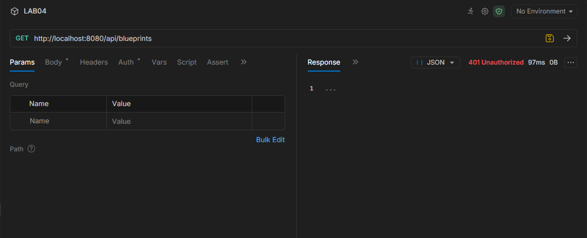
Como podemos ver en la imagen anterior la pagina de la api esta protegida por el Security ya que al hacerle una peticion GET al url http://localhost:8080/api/blueprints sin autenticacion recibimos un error 401 Unauthorize.

Esto por que pasa ya que tiene que pasar primero por una auntentificacion por lo que el unico URL publico es http://localhost:8080/auth/login. que pues permite que los usuarios se autentiquen y reciban un token, el cual se debe enviar en el header de cada peticion. Tambien la URL /actuator/health esta para ver la disponibilidad de la API. y pues el SWAGGER para ver su documentacion. Esto se ve reflejado tambien en la imagen anterior por lo que ahora vamos a ver que pasa cuando hacemos el post y ya estamos autenticados.

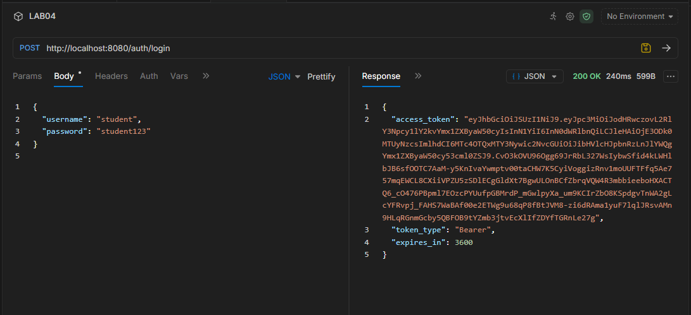
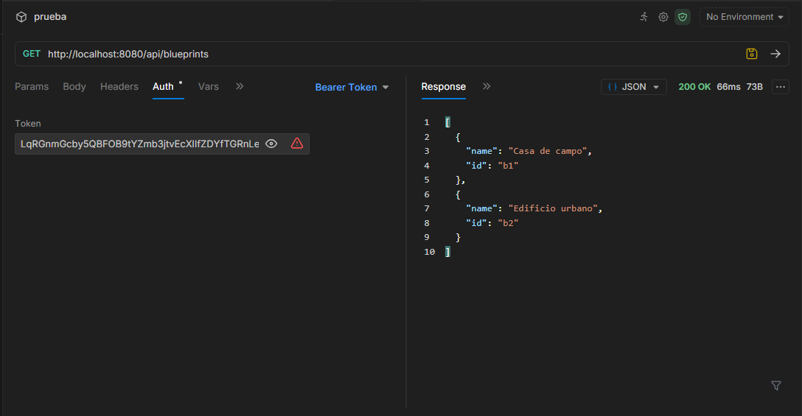
Como podemos ver ya con el token obtenido anterior mente ya podemos verficar que si podemos acceder a la API.

### Punto 2.
Para explorar el flujo del login y la emision del token nos dirigimos a la clase AuthController.java y podemos ver que hay un metodo @PostMapping que es el que nos ayuda a ver los claims que se le asignan al token, el emisor del token, la fecha de expiracion por lo que con una herramiento y el access_token podemos verificar si estan o no los claims como podemos ver en la siguiente imagen con la herrmienta de jwt.io.

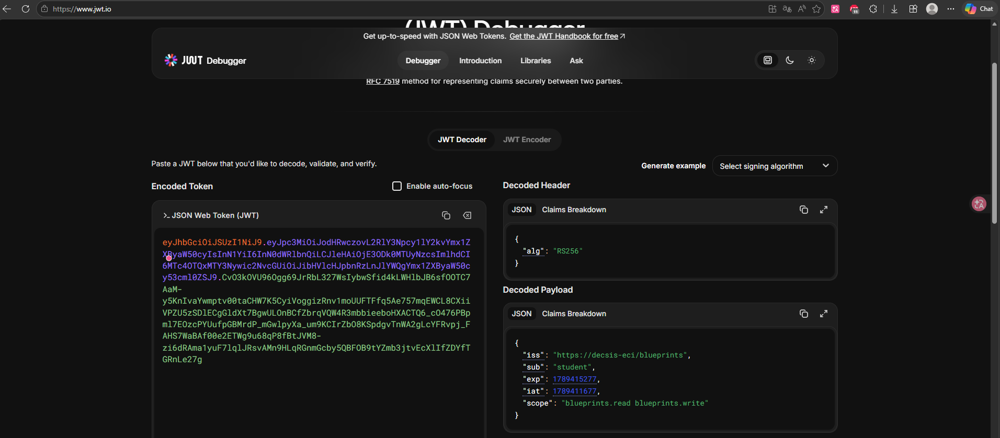

Vemos que si se cumple los claims y que son cada uno 
1. iss: Quien emitio el token
2. sub: A quien pertecene el token
3. iat: Fecha y hora de emision 
4. exp: Fecha y hora de expiracion 
5. scope: permisos del token.

Profundizando un poco mas en como esta compuesto el access_token vemos que hay tres partes una en rojo o naranja, una en morado y otra en verde que significa cada una de estas partes:

1. Define el algoritmo de encriptacion para el token en este caso algoritmo asimetrco RSA 
2. Son los datos del claim que son los datos concretos de el token como tal 
3. Es la firma digital del token y se utiliza para verificar que el token no ha sido manipulado.

### Punto 3. 
Ahora lo que vamos a manejar los permisos dentro de la misma api o los scopes de los usuarios ya que no todos pueden ver o modificar los planos en este caso de los edificios para este ejemplo en el lab por lo que primero lo que hacemos es esto.

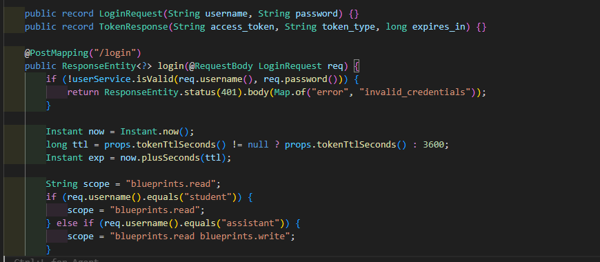

una condicion donde va a verificar si tiene permiso o no para acceder al endpoint en este caso el estudiante solo va a poder ver o hacer un GET y el assistant va a poder ver y modificar o hacer un GET o POST O PUT O DELETE. ya que asi se cumple pues el caso de este lab. 

Ahora modificamos el endpoint para que dependiendo el usuario se puedan hacer estas peticiones y nos responda el servidor. 

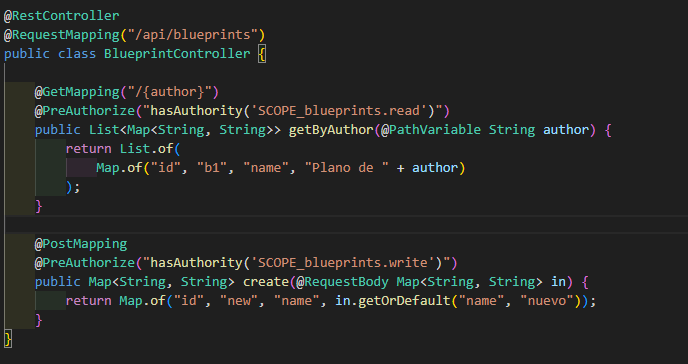

Como podemos ver en la imagen anterior ahora podemos acceder a la API y podemos ver los planos que tiene asociado el author por lo que ahora podemos ver que si funcionan los permisos dentro de la API. 

Ahora vamos a ver que si funciona con los endpoints de GET y POST. 

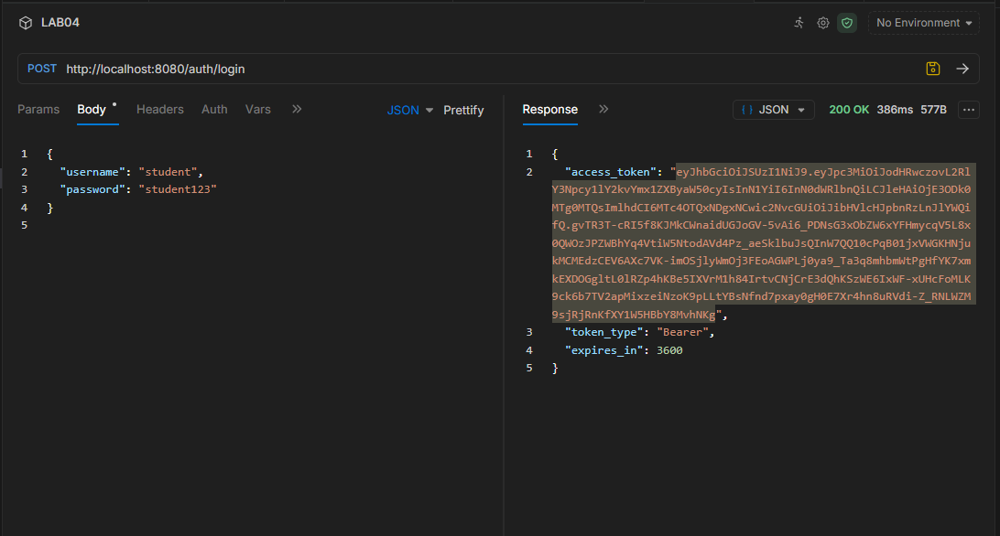

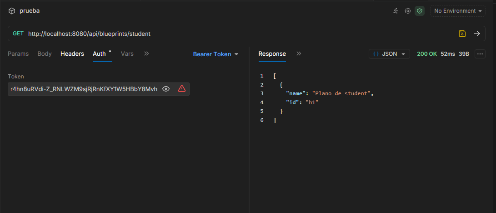

vimos para el get para el student esta bien pero:

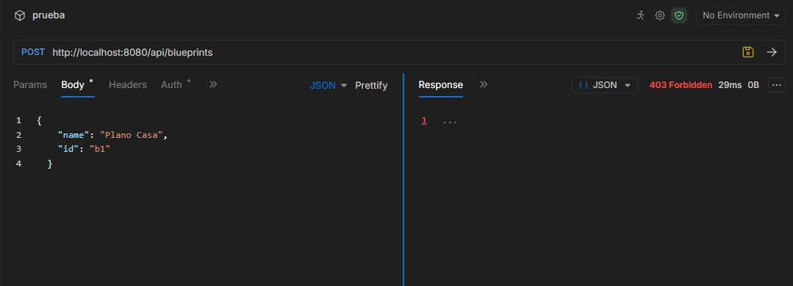

Cuando hacemos el post da un 403 por que el student no tiene permiso para hacer un post de un blueprint, por lo que ahora vamos a ver que pasa cuando el assistant intenta hacer un post de un blueprint. 

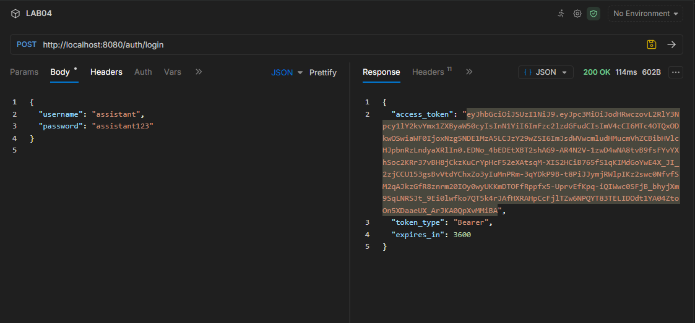

Aca vemos que nos logueamos como assistant 

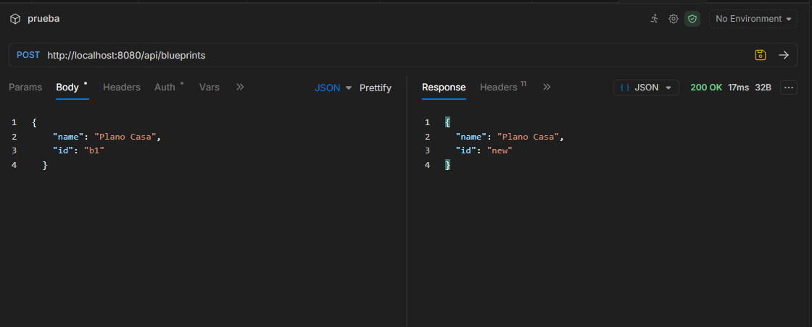

y si deja crear el blueprint por que el assistant si tiene permiso para hacer un post de un blueprint.

---

#### LAB04 Arquitecturas de Software
Este laboratorio extiende la **Parte 1** ([Lab_P1_BluePrints_Java21_API](https://github.com/DECSIS-ECI/Lab_P1_BluePrints_Java21_API)) agregando **seguridad a la API** usando **Spring Boot 3, Java 21 y JWT (OAuth 2.0)**.  
El API se convierte en un **Resource Server** protegido por tokens Bearer firmados con **RS256**.  
Incluye un endpoint didáctico `/auth/login` que emite el token para facilitar las pruebas.

---

## Objetivos
- Implementar seguridad en servicios REST usando **OAuth2 Resource Server**.
- Configurar emisión y validación de **JWT**.
- Proteger endpoints con **roles y scopes** (`blueprints.read`, `blueprints.write`).
- Integrar la documentación de seguridad en **Swagger/OpenAPI**.

---

## Requisitos
- JDK 21
- Maven 3.9+
- Git

---

## Ejecución del proyecto
1. Clonar o descomprimir el proyecto:
   ```bash
   git clone https://github.com/DECSIS-ECI/Lab_P2_BluePrints_Java21_API_Security_JWT.git
   cd Lab_P2_BluePrints_Java21_API_Security_JWT
   ```
   ó si el profesor entrega el `.zip`, descomprimirlo y entrar en la carpeta.

2. Ejecutar con Maven:
   ```bash
   mvn -q -DskipTests spring-boot:run
   ```

3. Verificar que la aplicación levante en `http://localhost:8080`.

---

## Endpoints principales

### 1. Login (emite token)
```
POST http://localhost:8080/auth/login
Content-Type: application/json

{
  "username": "student",
  "password": "student123"
}
```
Respuesta:
```json
{
  "access_token": "eyJhbGciOiJSUzI1NiIsInR5cCI6IkpXVCJ9...",
  "token_type": "Bearer",
  "expires_in": 3600
}
```

### 2. Consultar blueprints (requiere scope `blueprints.read`)
```
GET http://localhost:8080/api/blueprints
Authorization: Bearer <ACCESS_TOKEN>
```

### 3. Crear blueprint (requiere scope `blueprints.write`)
```
POST http://localhost:8080/api/blueprints
Authorization: Bearer <ACCESS_TOKEN>
Content-Type: application/json

{
  "name": "Nuevo Plano"
}
```

---

## Swagger UI
- URL: [http://localhost:8080/swagger-ui/index.html](http://localhost:8080/swagger-ui/index.html)
- Pulsa **Authorize**, ingresa el token en el formato:
  ```
  Bearer eyJhbGciOi...
  ```

---

## Estructura del proyecto
```
src/main/java/co/edu/eci/blueprints/
  ├── api/BlueprintController.java       # Endpoints protegidos
  ├── auth/AuthController.java           # Login didáctico para emitir tokens
  ├── config/OpenApiConfig.java          # Configuración Swagger + JWT
  └── security/
       ├── SecurityConfig.java
       ├── MethodSecurityConfig.java
       ├── JwtKeyProvider.java
       ├── InMemoryUserService.java
       └── RsaKeyProperties.java
src/main/resources/
  └── application.yml
```

---

## Actividades propuestas
1. Revisar el código de configuración de seguridad (`SecurityConfig`) e identificar cómo se definen los endpoints públicos y protegidos.
2. Explorar el flujo de login y analizar las claims del JWT emitido.
3. Extender los scopes (`blueprints.read`, `blueprints.write`) para controlar otros endpoints de la API, del laboratorio P1 trabajado.
4. Modificar el tiempo de expiración del token y observar el efecto.
5. Documentar en Swagger los endpoints de autenticación y de negocio.

---

## Lecturas recomendadas
- [Spring Security Reference – OAuth2 Resource Server](https://docs.spring.io/spring-security/reference/servlet/oauth2/resource-server/index.html)
- [Spring Boot – Securing Web Applications](https://spring.io/guides/gs/securing-web/)
- [JSON Web Tokens – jwt.io](https://jwt.io/introduction)

---

## Licencia
Proyecto educativo con fines académicos – Escuela Colombiana de Ingeniería Julio Garavito.
